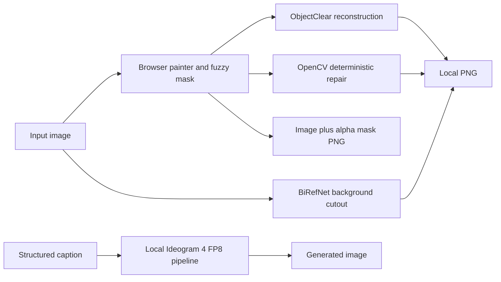

# Ideogram Architecture and Operations

This document covers only the runtime shipped in this monorepo: local Ideogram 4 generation, the object-removal workbench, and the optional ComfyUI adapter.

## Architecture



The editing and generation lanes are intentionally separate. The released Ideogram 4 checkpoint is text-to-image; mask-aware removal is handled by ObjectClear, BiRefNet, or OpenCV. The painter can export a standard mask or one PNG that ComfyUI reads as both IMAGE and MASK.

## First setup

```bash
cd ~/multimedia/ideogram
uv venv --python 3.12.10 --seed --managed-python .venv
source .venv/bin/activate
uv pip install --torch-backend auto torch torchvision
uv pip install -r requirements-local.txt
cp .env.local.example .env
```

The shared model downloader supplies the configured FP8, ObjectClear, and BiRefNet paths. Runtime code does not download checkpoints.

## Runtime lanes

- Object-removal browser: `./start-object-remover.sh` on port `8174` by default.
- Object-removal CLI:

  ```bash
  python -m object_remover.cli image.png mask.png cleaned.png \
    --method telea --radius 5 --grow 5 --feather 4
  ```

- Ideogram generation: set `PYTHONPATH="$PWD/src"`, then run `python local_generate.py --help`.

  ```bash
  export PYTHONPATH="$PWD/src${PYTHONPATH:+:$PYTHONPATH}"
  python local_generate.py \
    --prompt-file caption.json --preset V4_DEFAULT_20 --output design.png
  ```

- ComfyUI adapter: place `ComfyUI-Ideogram4` under an existing ComfyUI `custom_nodes` directory and import `workflows/ideogram-local-workflow.json`.

All weights stay under `~/multimedia/models`; outputs and local `.env` values remain untracked.
