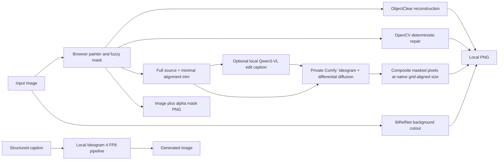

# Ideogram Architecture and Operations

This document covers the runtime shipped in this monorepo: local Ideogram 4 generation, the editing workbench, its private masked-edit engine, and the optional external ComfyUI adapter.

## Architecture



Model implementations and sampling defaults are unchanged. The wrappers now pass source-sized images instead of reduced-resolution images. The optional **Ideogram 4 masked edit** engine uses the same local base checkpoint for image-conditioned masked sampling, not a hosted edit API or the generation-only CLI. The painter still exports a standard mask or one PNG that Comfy reads as both IMAGE and MASK.

## Masked editing in the WebUI

1. Open an image and paint the object/region to change, or use **Lasso** to draw a freehand outline (release to fill it); choose **Ideogram 4 masked edit**. Multiple lasso/brush selections accumulate in the same mask, and Erase refines it.
2. Describe the desired result and choose the mask feather. There is no processing-size or selection-crop setting.
3. **Review masked edit** freezes the current source/mask/settings and displays native processing dimensions, any right/bottom alignment trim and feathered mask. Draft/paste/edit the caption JSON there. **Caption seed** controls low-temperature text sampling; change it and redraft if the instruction was missed. **Edit seed** separately controls diffusion. Nothing generates an image until **Run approved edit**. Back to mask cancels this review. Valid supplied JSON bypasses caption inference. Existing API callers can still use the old one-call auto-caption route; `reviewed=true` requires a nonempty valid caption.
4. Download the native-size lossless PNG. The source canvas is not replaced by the result. **Remove background** operates on the displayed result when the Result tab is selected; switching to Mask uses the original source.

For **background replacement**, paint the foreground to preserve, select **Edit outside the selection**, and describe the new background. For a **transparent background**, either use the unchanged automatic BiRefNet button or paint the foreground and choose **Cut out selected foreground** (mask-only, no model, no resizing). Ideogram inpainting does not return a segmentation alpha mask; these are deliberately different operations.

**Auto-select foreground** uses the installed BiRefNet model at source resolution (32-pixel grid), then the existing guided edge refinement. Its native mask becomes editable with Undo; only an alignment remainder is left unselected, never stretched to fit. Inspect/correct it with the brush/eraser before **Cut out selected foreground**. Cutout retains source RGB and multiplies any existing alpha. It does not delete pixels based on their color. Workbench-owned models are unloaded for this stage and the matting model is released afterward. Native dimensions do not guarantee perfect hair/glass segmentation.

Coordinate boxes are selection/caption hints, not rectangular edit masks. Ideogram receives the full aligned source for context. Include a related shadow or mirror reflection with another brush/lasso selection when it should disappear too. Ideogram's strict final compositing cannot remove something outside the mask; automatic semantic discovery of related regions is not implemented or claimed. ObjectClear retains its own upstream attention-guided fusion behavior.

### Resolution and preservation

The inference wrappers never downscale, upscale, pad, select a smaller processing region or retry at a lower resolution. Input dimensions determine output dimensions. If necessary, only the right/bottom remainder is cropped to the nearest lower grid multiple: 16 for ObjectClear (VAE stride 8 plus AGF half-latent map) and Ideogram; 32 for BiRefNet’s patch layout. Already aligned images keep every input pixel. Masks use identical coordinates and trims; mismatched masks and model outputs are rejected, not resized. Inputs smaller than the required grid fail explicitly. An out-of-memory error remains an error.

The mask, sampler, model loaders, model-internal feature pyramids and Ideogram's pre-existing VAE graph are unchanged. This is a wrapper geometry fix, not a change to the models. Ideogram composites only feathered-mask pixels; BiRefNet retains source RGB and supplies alpha. Review thumbnails are display-only and never inference inputs. Legacy API form fields `resolution` and `padding` are ignored. Quality and VRAM requirements depend on the checkpoint and source size; native dimensions are not a quality guarantee. Metadata/profile preservation is not promised. Undo retains at most 256 MiB worth of masks (one full mask minimum).

### Private engine, local weights

`private_comfy.py` owns its subprocess, startup checks, deadline and cleanup. It uses the **vendored runtime source** at `../minimax/runtime`, not the Minimax application or its running service. This avoids duplicating Comfy in the runtime-only monorepo. It binds only to loopback (default `8175`); the workbench remains LAN-accessible at `0.0.0.0:8174`. No external Comfy URL is accepted. An occupied port is an error, not permission to use or kill that service.

The existing Minimax virtualenv is reused when present; `IDEOGRAM_COMFY_PYTHON` can instead point to an independently provisioned interpreter. All input/output/temp/user/database/log files are confined to `ideogram/.runtime/editing`, not the shared runtime tree. Uploaded crop files and returned output files are deleted after use. Failed/crashed runs may leave diagnostics or partial artifacts there. No source image or downloaded result is deleted. Stop/shutdown kills only the owned process group. A force-kill of the web server cannot execute normal Python cleanup.

Both successful and failed caption/edit requests stop the private engine afterward. Captioning stops before loading the large diffusion models. Switching to Ideogram unloads the other **workbench-owned** models to release VRAM; unrelated services are never stopped. “Start engine” checks availability and starts Comfy, but does not preload 27 GB of weights.

Captioning uses a concise edit-specific schema, not the generation prompt's instructions to invent visual embellishments. The upstream validator checks the response before sampling. An invalid response receives at most one local formatting-repair attempt; persistent invalid JSON is an explicit error, not an infinite retry or a fallback to a hosted model. The caption API returns that last draft with HTTP 422, and both drafting controls retain it for manual correction. Validation checks structure, not whether the model understood the edit: review the objects and positions too. The mask/cutout routes reject decoded images above `OBJECT_REMOVER_MAX_PIXELS` (100 million by default) before processing; ordinary 4K/8K images fit.

Weights:

- `IDEOGRAM4_FP8_MODEL`: the existing `models/ideogram-ai--ideogram-4-fp8` folder, containing the conditional/unconditional DiTs, text encoder and VAE.
- `IDEOGRAM_CAPTION_MODEL`: by default the existing `models/qwen/text-encoder-vl-nvfp4/qwen3_vl_4b_nvfp4_full.safetensors`. This is a local vision-language drafting helper, not a new dependency on a music model. Its input is the unpainted crop, the selection bounds and your instructions. The mask itself controls diffusion, not the caption model. Instructions and editable JSON describe the intended result; drafting is not guaranteed to infer the correct removal from an ambiguous mask.

`comfy_nodes/` preserves the official checkpoint's **per-output-row FP8 scales**. It does not rename them into a different quantization format, requantize, or download converted checkpoints. Storage remains FP8; each linear operation casts and applies its row scales before matrix multiplication, matching the native loader. Ordinary Comfy offloading manages the models; dynamic-weight patching is disabled for these custom loaders. Layout mismatches fail explicitly. Conditioning uses the native 8B language tensors and 13 hidden-layer taps; the unused vision tensors are not loaded for conditioning. Captioning instead uses Comfy's existing Qwen3-VL generation node.

The graph is `VAEEncodeTiled → SetLatentNoiseMask → DifferentialDiffusion → DualModelGuider → Ideogram4Scheduler/Euler → VAEDecodeTiled`. Both diffusion models are used. Denoising strength trims the schedule; the UI guidance is a constant CFG, not the upstream generation preset's multi-stage CFG schedule. No LoRA or patched Comfy core is required for this path.

### Research basis and boundaries

- [OzzyGT's Ideogram 4 inpainting implementation](https://huggingface.co/blog/OzzyGT/ideogram-4-inpainting) demonstrates JSON-conditioned image/soft-mask differential diffusion. This workbench implements that sampling approach using our native Comfy runtime and existing FP8 files; it does not download/execute the article's remote Diffusers blocks.
- [Official Ideogram 4 source](https://github.com/ideogram-oss/ideogram4) supplies the checkpoint architecture, native FP8 math and caption validation.
- [BitPoet's reference-editing workflow](https://github.com/BitPoet/ComfyUI-bitpoet-IG4Inpaint) is a separate LoRA/core-modification approach, not silently mixed into this one.
- [Krea2Edit](https://github.com/lbouaraba/comfyui-krea2edit) is a geometry/reference-conditioning comparison, not an Ideogram adapter. Its trained edit LoRA uses image-grounded Qwen conditioning plus clean VAE reference tokens. Pixel-space fitting and pre-encoding avoid distortion/offloading penalties; those principles apply here, but its LoRA and reference-token patch do not transfer between unrelated models. Its authors recommend ≤2MP and Raw/CFG3 for removal, and explicitly document unreliable removals in some cases. The user's Krea model archive is not unpacked or changed by this integration.

This integration does not claim a published automatic Ideogram alpha-matting model, guaranteed superior removal, or benchmarked native 8K quality. Follow the checkpoint's bundled model license, including its non-commercial terms where applicable.

## First setup (fresh environment only)

```bash
cd ~/multimedia/ideogram
uv venv --python 3.12.10 --seed --managed-python .venv
source .venv/bin/activate
uv pip install --torch-backend auto torch torchvision
uv pip install -r requirements-local.txt
cp .env.local.example .env
```

The shared model downloader's Ideogram selection supplies FP8, ObjectClear, BiRefNet and the local Qwen caption helper. The helper is shared with Minimax and deduplicated when both projects are selected. Runtime code does not download checkpoints.

Existing installations should **not** recreate their virtualenv or overwrite `.env`. The already-provisioned Minimax runtime/interpreter is sufficient for the private Comfy lane. If using a separate interpreter, install `../minimax/runtime/requirements.txt` into that environment with `uv pip install --python /path/to/python --torch-backend YOUR_BACKEND -r ../minimax/runtime/requirements.txt`, then set `IDEOGRAM_COMFY_PYTHON`. No model files are installed by that command. The optional local caption model is the same one used by Minimax's prompt helper; set its path or supply caption JSON manually.

New settings are documented in `.env.local.example`; omitted settings have defaults. Restart only the editing workbench after updating its Python code. No Minimax service restart is needed.

## Checks

```bash
cd ~/multimedia/ideogram
.venv/bin/python -m unittest discover -s tests -v
../minimax/.venv/bin/python tests/comfy_contract.py
bun tests/selection_contract.js
```

The first suite tests native source/alpha preservation, grid-only trimming, tiled alpha consistency, masks, caption validation, bounded repair and lifecycle guardrails. API-client checks additionally use the optional `httpx` test dependency, and skip if it is absent. The second uses CPU mode, tiny tensors and checkpoint **headers**, then starts/stops a private CPU Comfy instance to validate node contracts; it does not run large-model inference. The JavaScript contract checks the real painter's event handlers with mock canvas contexts (lasso commit/cancel, additive regions, pointer isolation, brush/erase and undo), frozen review inputs, exact 64-bit seeds, explicit approval and retained failed drafts; it does not launch a browser. Temporary test directories are separate from production state.

During integration a real local Qwen caption + 20-step Ideogram smoke test removed a brown square from a synthetic 512×512 image. A separate 4-step test exercised the graph but was insufficient to remove the square. These are integration checks, not comparisons against ObjectClear or evidence of photographic/4K/8K quality. No model weights were downloaded, no production virtualenv was reinstalled, and no other service was restarted.

### Historical photographic check (2026-09-04, before native-resolution correction)

The reduced-resolution processing described below is historical and is no longer used.

A supplied 2160×1440 gym scene was tested with explicit masks for the central woman, her far-left mirror reflection, and nearby floor shadow. Whole-image context fit into 2048×1365 content with a 2048×1376 padded processing canvas. A **manually reviewed caption**, seed 42, CFG 4 and 20 steps produced an edit in 81.11 seconds on the workstation. Visual inspection confirmed removal of both selected figures and reconstructed equipment/floor; the generated equipment is an inferred fill, not known ground truth. The result stayed 2160×1440, and a byte comparison confirmed no changes outside the feathered mask. This was not an automatic reflection-discovery test.

The local 4B Qwen caption helper failed JSON validation on this scene, including seeded trials at 42 and 43 with bounded retries. One returned draft also incorrectly retained the woman in its object list. No failed draft was sent to diffusion. This is why the review step retains the draft and requires explicit approval; successful removal is not evidence that automatic captioning understood this scene. A different seed is an option, not a promised repair.

The optional local foreground-alpha stage took 11.27 seconds, returned a full-size RGBA cutout, and preserved original RGB bytes. Its automatic mask selected the two foreground people, omitted the rear person, and retained some edge/equipment residue; brush/eraser refinement is still necessary for that scene. A checkerboard preview was inspected as well as the alpha channel. High-resolution geometry is covered by CPU tests; photographic 4K/8K inference quality is not benchmarked. Test images, generated files, model state and logs remain outside Git.

### Native-resolution check (2026-09-05)

CPU contracts verify complete 2400×1600 and odd-sized image inputs, pixel-for-pixel coordinate preservation after alignment trims, native BiRefNet tensors, output-size rejection and the Result → background-removal handoff. No hidden resizing or low-resolution retry is used.

An offline real-model check on the supplied gym image ran ObjectClear at **2160×1440** (20 steps, CFG 2.5, seed 42; 31.24 seconds), then passed that exact result to BiRefNet at **2144×1440** (16 right-edge pixels trimmed; 2.08 seconds). RGB bytes were preserved through background removal. This validates execution and geometry, **not photographic quality**: the removal introduced body/equipment artifacts in the selected region. A checkerboard alpha inspection confirmed the two remaining people were retained, but also unwanted equipment and rough equipment boundaries (85.89% of alpha pixels below 16/255, 13.28% at least 240/255). Do not interpret a successful PNG or a nonconstant alpha as a quality pass. No checkpoint/model internals were changed to conceal these results.

Opt-in GPU check using existing local weights, no server:
```bash
HF_HUB_OFFLINE=1 TRANSFORMERS_OFFLINE=1 .venv/bin/python tests/native_smoke.py image.png mask.png /path/to/test-output
```
The script unloads only its own models. Artifacts stay outside Git.

## Runtime lanes

- Object-removal browser: `./start-object-remover.sh` on port `8174` by default.
- Object-removal CLI:

  ```bash
  python -m object_remover.cli image.png mask.png cleaned.png \
    --method telea --radius 5 --grow 5 --feather 4
  ```

- Ideogram generation: set `PYTHONPATH="$PWD/src"`, then run `python local_generate.py --help`.

  ```bash
  export PYTHONPATH="$PWD/src${PYTHONPATH:+:$PYTHONPATH}"
  python local_generate.py \
    --prompt-file caption.json --preset V4_DEFAULT_20 --output design.png
  ```

- ComfyUI adapter: place `ComfyUI-Ideogram4` under an existing ComfyUI `custom_nodes` directory and import `workflows/ideogram-local-workflow.json`.

All weights stay under `~/multimedia/models`; outputs and local `.env` values remain untracked.
