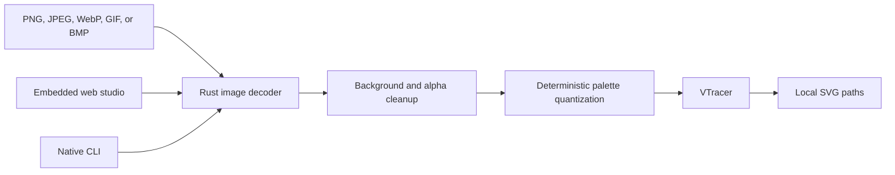

# img2svg Architecture and Operations

## Architecture



One Rust binary owns decoding, tracing, the CLI, and the embedded browser interface. Inputs never leave the host.

## Build and run

```bash
cd ~/multimedia/img2svg
./setupwithrust
./startwithrust
```

The setup performs a native release build with Cargo. The browser listens on port `417` unless `IMG2SVG_HOST` or `IMG2SVG_PORT` overrides it.

## Runtime lanes

- Browser: `./startwithrust`
- One conversion:

  ```bash
  target/release/img2svg convert logo.png logo.svg --preset logo --colors 6
  ```

- Recursive conversion:

  ```bash
  target/release/img2svg convert rasters vectors \
    --recursive true --preset poster --colors 12
  ```

Web uploads are bounded before decoding. Output is plain SVG path markup with no scripts or remote assets.
