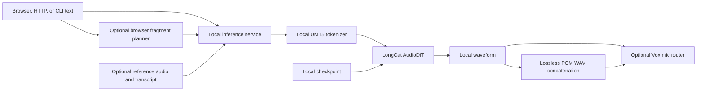

# LongCat Architecture and Operations

## Architecture



The browser, HTTP service, and CLI share the same inference implementation while keeping browser-owned and machine-service model lifecycles separate.

## Setup

```bash
cd ~/multimedia/longcat
./setupwithuv.sh gpu
```

Verify `LONGCAT_MODEL_PATH` and `LONGCAT_TOKENIZER_PATH` in `.env` before loading. Setup installs dependencies but does not download checkpoints.

## Runtime lanes

- Machine HTTP service: `./starthttp.sh` on port `8230`.
- Browser workbench: `./startwithuv.sh` on port `8231`.
- CLI:

  ```bash
  source .venv/bin/activate
  uv run --active --no-sync python -m local_tts.cli \
    'A local voice model with no cloud service.' \
    --guidance-method apg --steps 16 -o outputs/voice.wav
  ```

The browser can attach to an already loaded HTTP backend instead of loading a duplicate model. Each process unloads only the weights it owns when stopped.

## Browser auto-concatenation

The default workbench path remains one text request and one returned WAV.
Enabling **Auto-concatenate** adds a browser-owned plan modeled on Vox's
sentence-aware LongCat route. The character target scans backward to the
nearest `.`, `—`, `!`, or `?`; when none exists before the target, it scans
forward, and it never cuts an unpunctuated sentence. Every fragment is sent
through the ordinary `/api/synthesize` contract in order. The local
`/api/concatenate` endpoint joins compatible PCM frames without resampling or
placing fragment files on disk.

Unwrapped input uses Voice 1. `{text}` selects Voice 2 and `{{text}}` selects
Voice 3; the selectors are removed before both character counting and model
input. Voice 2 and Voice 3 each require their own reference audio/transcript
pair when used. All fragments begin with the form's seed. Their temporary
browser list exposes each WAV and its active seed, and a successful individual
reroll atomically replaces that fragment and rebuilds the final WAV. A failed
reroll leaves both the prior fragment and prior final output available. This
session data is intentionally ephemeral and disappears with the page.
