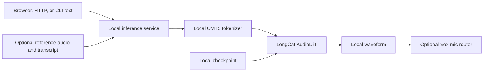

# LongCat Architecture and Operations

## Architecture



The browser, HTTP service, and CLI share the same inference implementation while keeping browser-owned and machine-service model lifecycles separate.

## Setup

```bash
cd ~/multimedia/longcat
./setupwithuv gpu
```

Verify `LONGCAT_MODEL_PATH` and `LONGCAT_TOKENIZER_PATH` in `.env` before loading. Setup installs dependencies but does not download checkpoints.

## Runtime lanes

- Machine HTTP service: `./starthttp.sh` on port `8230`.
- Browser workbench: `./startwithuv.sh` on port `8231`.
- CLI:

  ```bash
  source .venv/bin/activate
  uv run --active --no-sync python -m local_tts.cli \
    'A local voice model with no cloud service.' \
    --guidance-method apg --steps 16 -o outputs/voice.wav
  ```

The browser can attach to an already loaded HTTP backend instead of loading a duplicate model. Each process unloads only the weights it owns when stopped.
