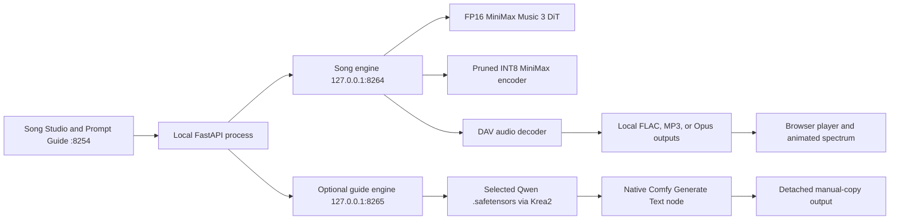

# MiniMax Music 3 local runtime

This folder is a standalone, zero-telemetry MiniMax Music 3 studio. Its browser UI owns a private inference engine and submits the same model graph as the official MiniMax Music 3 Comfy workflow; no separate ComfyUI process or browser tab is required.



## Setup and start

```bash
cd ~/multimedia/minimax
./setupwithuv gpu
./startwithuv.sh
```

Open `http://127.0.0.1:8254`. Both inference engines bind only to loopback. `Load models` makes the DiT, MiniMax text encoder, and DAV resident; `Unload` releases them. Prompt Guide is stateless and off at every server start: its secondary process does not exist and its Qwen weights are not resident until the tab's switch is enabled. Turning the switch off interrupts that lane, frees its weights, and stops its process. `Ctrl+C` unloads all resident weights and stops the web app plus both private engines.

## Exact local model layout

```text
../models/Comfy-Org--Minimax-Music-3/
├── diffusion_models/minimax_music3_dit_fp16.safetensors
├── text_encoders/minimax_music3_text_encoder_pruned_int8_convrot.safetensors
└── vae/minimax_music3_dav.safetensors

../models/qwen/text-encoder-vl-nvfp4/
└── qwen3_vl_4b_nvfp4_full.safetensors
```

The source tree deliberately selects the full FP16 DiT, the official pruned INT8 text encoder, and the sole DAV checkpoint. Lower-quality DiT variants and the unpruned encoder are not part of the portable model manifest.

The optional default guide checkpoint is downloaded from `SergiusFlavius/Qwen3-VL-4B-Instruct-heretic-NVFP4` and loaded through Comfy's native `CLIPLoader` with `type=krea2`, then its native `TextGenerate` node. The browser can enumerate other `.safetensors` files beneath `MINIMAX_GUIDE_MODEL_ROOT`; selecting one does not persist a preference, upload a file, or make a network request. Alternate checkpoints must themselves be compatible with the Krea2 loader.

## Real workflow controls

The composer exposes both MiniMax conditioning and diffusion inputs: structured caption, tagged lyrics, duration, shared seed, CFG, acoustic top-k, batch size, sampler, scheduler, steps, tiled decode parameters, and output codec. The default values match the official graph: 30 steps, CFG 1.7, top-k 50, Euler, and the simple scheduler.

Tiled VAE decoding is useful when long songs exceed available VRAM. Leave it disabled on a 24 GB or larger card for maximum decode speed and to avoid tile seams. Generated audio remains in the ignored `outputs/` directory. The animated performance view is a browser-only audio visualization and never changes inference or model residency.

## Prompt Guide contract

Prompt Guide mirrors the proven Comfy graph and controls: sampling enabled, temperature `0.7`, text top-k `64`, top-p `0.95`, min-p `0.05`, repetition penalty `1.05`, seed `0`, presence penalty `0`, thinking disabled, and the checkpoint's default template enabled. Its MiniMax-specific instruction follows the official caption-rewriter contract for `Global Metadata`, `Vocal Details`, and a chronological `Arrangement`, then adds a separate `Tuning Notes` block grounded in the visible generation controls.

The Guided Brief Lab is a browser-only writing aid in front of that model. One-click recipes and expandable genre, palette, tonal-center, mode, BPM, meter, groove, harmony, performance, form, production, and listening-context choices assemble an editable English pre-prompt. Unselected dimensions remain absent. The user can copy, replace, or append the result to the ordinary music brief; no recipe queues inference or changes Song Studio controls. Exact tempo, key, meter, instrumentation, and structure remain generative guidance rather than symbolic guarantees. The exact Generate Text controls include a one-click seed reroll so a weak Qwen sample can be retried without disturbing a sound brief.

Guide output is intentionally one-way. It never mutates the composer, queues music, or applies recommended values. Each section and the raw response have explicit copy controls so the user decides what reaches MiniMax.
