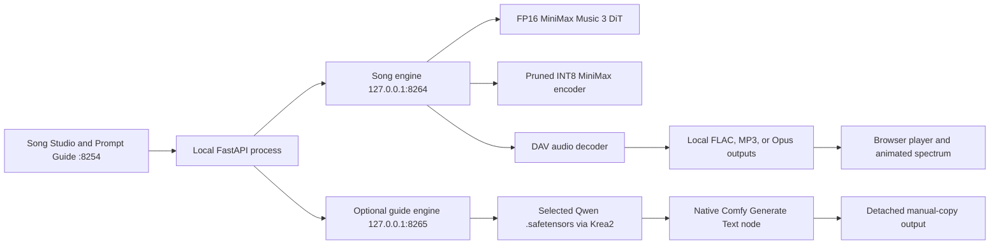

# MiniMax Music 3 local runtime

This folder is a standalone, zero-telemetry MiniMax Music 3 studio. Its browser UI owns a private inference engine and submits the same model graph as the official MiniMax Music 3 Comfy workflow; no separate ComfyUI process or browser tab is required.



## Setup and start

```bash
cd ~/multimedia/minimax
./setupwithuv gpu
./startwithuv.sh
```

Open `http://127.0.0.1:8254`. Both inference engines bind only to loopback. `Load models` makes the DiT, MiniMax text encoder, and DAV resident; `Unload` releases them. Prompt Guide is stateless and off at every server start: its secondary process does not exist and its Qwen weights are not resident until the tab's switch is enabled. Turning the switch off interrupts that lane, frees its weights, and stops its process. `Ctrl+C` unloads all resident weights and stops the web app plus both private engines.

Song Studio has one intentionally process-local take ledger. A browser refresh reattaches to every queued, rendering, completed, failed, or cancelled take owned by the running server and restores that tab's current form draft. Each generation receives a stable `Take` number; batch outputs remain grouped beneath that take. Individual active takes can be cancelled without cancelling a different queued take. Clearing a finished take removes it from the live ledger but never deletes its rendered audio. Restarting the server creates a new session identifier and returns the browser to the baseline form and empty ledger, while existing files remain in `outputs/`.

## Exact local model layout

```text
../models/Comfy-Org--Minimax-Music-3/
├── diffusion_models/minimax_music3_dit_fp16.safetensors
├── text_encoders/minimax_music3_text_encoder_pruned_int8_convrot.safetensors
└── vae/minimax_music3_dav.safetensors

../models/qwen/text-encoder-vl-nvfp4/
└── qwen3_vl_4b_nvfp4_full.safetensors
```

The source tree deliberately selects the full FP16 DiT, the official pruned INT8 text encoder, and the sole DAV checkpoint. Lower-quality DiT variants and the unpruned encoder are not part of the portable model manifest.

The optional default guide checkpoint is downloaded from `SergiusFlavius/Qwen3-VL-4B-Instruct-heretic-NVFP4` and loaded through Comfy's native `CLIPLoader` with `type=krea2`, then its native `TextGenerate` node. The browser can enumerate other `.safetensors` files beneath `MINIMAX_GUIDE_MODEL_ROOT`; selection is remembered only in the live draft or an explicit JSON export. Selecting a file does not upload or load it. Alternate checkpoints must themselves be compatible with the Krea2 loader.

## Real workflow controls

The composer exposes both MiniMax conditioning and diffusion inputs: structured caption, tagged lyrics, duration, shared seed, CFG, acoustic top-k, batch size, sampler, scheduler, steps, tiled decode parameters, and output codec. The default values match the official graph: 30 steps, CFG 1.7, top-k 50, Euler, and the simple scheduler.

Tiled VAE decoding is useful when long songs exceed available VRAM. Leave it disabled on a 24 GB or larger card for maximum decode speed and to avoid tile seams. Generated audio remains in the ignored `outputs/` directory. The animated performance view is a browser-only audio visualization and never changes inference or model residency.

## Prompt Enhance

The writing assistant retains the existing isolated Qwen/Krea2 → TextGenerate path.
Song Studio's graph, model layout and generation defaults are unchanged.

- **Refine a brief:** Global Metadata, Vocal Details and Arrangement; lyrics are context only.
- **Keep my lyrics:** generates those same musical fields around finished lyrics. The server returns the original lyric string, including whitespace, instead of trusting a model echo.
- **Draft a song & lyrics:** those three fields plus an original lyric draft.
- **Ask about music:** a free-form question with optional Firecrawl research.

All output is text in a manual copy desk. No append/apply buttons, automatic song
generation, or recommended slider values. Model selection and text sampling
controls are under **Advanced**. Proven sampling defaults are retained; the text
output budget is 1024 tokens to leave room for lyrics or an answer. Increase it
there if a long draft is cut short. Generation quality still depends on the local model.

### Optional research

Set in `.env` (loaded by the existing launcher; defaults are documented in `.env.local.example`):

```dotenv
MINIMAX_GUIDE_FIRECRAWL_URL=http://127.0.0.1:3002
# Only if your self-hosted service requires a key:
MINIMAX_GUIDE_FIRECRAWL_API_KEY=
```

The URL may include a trailing `/v2`. The server uses Firecrawl's existing
[`POST /v2/search`](https://docs.firecrawl.dev/api-reference/endpoint/search)
with three web results and Markdown scraping enabled. The explicit search query
(or the first 500 characters of the question) is sent; studio state, lyrics and
constraints are not sent. Queries leave the local machine through Firecrawl's
search provider and the requested sites; model inference stays local.

Retrieved excerpts are bounded, marked as untrusted data, and supplied to the
same writing model with numbered citation instructions. The UI links the sources
and distinguishes page excerpts from search-only snippets. This researches written
descriptions; it does not listen to recordings or guarantee that an analysis is
correct. An unavailable service, malformed response or empty search is reported
explicitly **before inference**, not silently replaced with an unsourced answer.
Turn web lookup off to ask the local model alone. No Firecrawl lifecycle management
or configuration changes are performed by MiniMax.

## Portable, still-ephemeral state

**Export JSON** saves a versioned `mm-tools.minimax-session` snapshot: both form
drafts, selected workspace/take, latest writing response and source links, and the
server's take history (including generation settings). Treat exports as private:
they contain your prompts and lyrics. Audio bytes are not embedded; output-relative
filenames reconnect to files that still exist in this MiniMax output folder.

**Import JSON** validates the snapshot before replacing the current draft and shared
take ledger. Unfinished takes are marked cancelled, never requeued. Missing audio
is reported while retaining the rest of the history. Paths cannot escape the output
folder. Import does not load a model or change server configuration.

**Reset state** returns forms and history to the baseline. It never deletes output
files or unloads models. Both reset and import refuse while music jobs are active;
finish or cancel them first. The current browser also waits for its writing operation.
The take ledger is shared across browser tabs; draft controls are tab-local. Other
tabs discard their old drafts when they next refresh their changed session.

Refresh still restores the current live session. Restart still starts clean. A
snapshot is only restored when you explicitly import it; there is no new database,
automatic disk save or startup restore. State files have an 8 MiB UI limit and
up to 500 takes.

## CPU-only regression checks

From this directory, using the existing environment:

```bash
uv run --no-project --python .venv/bin/python python -m unittest discover -s tests -p 'test_*.py' -v
bun test tests/studio-state.test.js
```

These use temporary outputs and mocked research/inference: no model loading, music
generation or external search calls.
