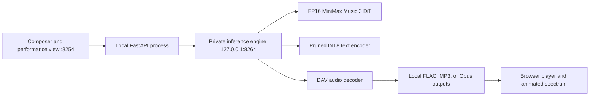

# MiniMax Music 3 local runtime

This folder is a standalone, zero-telemetry MiniMax Music 3 studio. Its browser UI owns a private inference engine and submits the same model graph as the official MiniMax Music 3 Comfy workflow; no separate ComfyUI process or browser tab is required.



## Setup and start

```bash
cd ~/multimedia/minimax
./setupwithuv gpu
./startwithuv.sh
```

Open `http://127.0.0.1:8254`. The engine itself binds only to loopback. `Load models` makes the DiT, text encoder, and DAV resident; `Unload` releases them. `Ctrl+C` interrupts work, unloads any resident weights, and stops both processes.

## Exact local model layout

```text
../models/Comfy-Org--Minimax-Music-3/
├── diffusion_models/minimax_music3_dit_fp16.safetensors
├── text_encoders/minimax_music3_text_encoder_pruned_int8_convrot.safetensors
└── vae/minimax_music3_dav.safetensors
```

The source tree deliberately selects the full FP16 DiT, the official pruned INT8 text encoder, and the sole DAV checkpoint. Lower-quality DiT variants and the unpruned encoder are not part of the portable model manifest.

## Real workflow controls

The composer exposes both MiniMax conditioning and diffusion inputs: structured caption, tagged lyrics, duration, shared seed, CFG, acoustic top-k, batch size, sampler, scheduler, steps, tiled decode parameters, and output codec. The default values match the official graph: 30 steps, CFG 1.7, top-k 50, Euler, and the simple scheduler.

Tiled VAE decoding is useful when long songs exceed available VRAM. Leave it disabled on a 24 GB or larger card for maximum decode speed and to avoid tile seams. Generated audio remains in the ignored `outputs/` directory. The animated performance view is a browser-only audio visualization and never changes inference or model residency.
