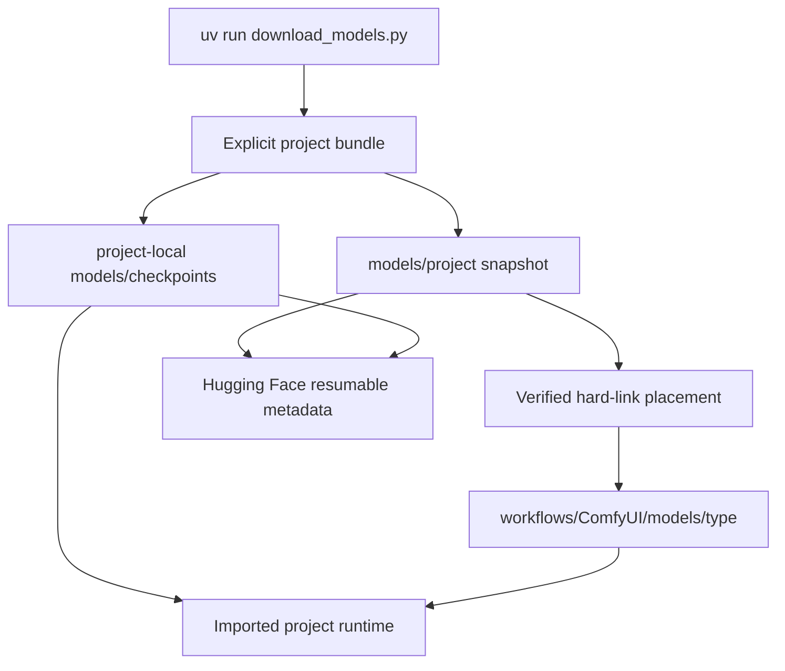

# Model Store Architecture

The tracked `models` directory contains a stateful downloader and its audited
inventory. Checkpoints, its temporary uv environment, caches, and downloaded
model-card files remain outside Git.

## Data flow



Older mm-tools applications keep their established shared-store paths.
Imported projects whose code documents a repository-local checkpoint path use
that path directly. Shared Wan, ID-V2V, and YuE2 Comfy weights are downloaded
once beneath `models/imports` and hard-linked into the PR-pinned local Comfy
runtime, avoiding duplicate disk consumption while keeping resumability.
TRELLIS.2 and Pixal3D likewise share pinned local DINOv3, the official ungated
ZhengPeng7 BiRefNet checkpoint, MoGe-2,
and NAF dependencies. Their pipeline configs and auxiliary loaders are
localized at runtime, so loading a sculpting model never resolves an upstream
repository name over the network.

## Populate selected bundles

```bash
cd ~/multimedia/models
uv venv --python 3.12.10 --seed --managed-python .venv
source .venv/bin/activate
uv pip install -U huggingface_hub hf_transfer

uv run download_models.py --list
uv run download_models.py 4d lingbot lingbot-5090 fire3d
uv run download_models.py aukspeech sculpting worldsculpt
uv run download_models.py v2v
uv run download_models.py nvidia-sim
uv run download_models.py yue2
```

Use `--workers N` to control Hugging Face snapshot file workers, and
`--yes` only for noninteractive execution. Rerunning the same selection resumes
it. The downloader creates missing parent directories, never prunes files, and
refuses to replace a conflicting runtime placement.

The former `animate` and `ltx` bundles are retired from this downloader.
Those weights now come from `workflows/download_models.py`, which ships
beside the committed ComfyUI pipeline exports; its snapshots land in
`workflows/models/imports/` and hard-link into `workflows/ComfyUI/models/*`
exactly as the retired entries did.

## Boundaries

- New snapshots are pinned to audited immutable Hub revisions and filtered by
  explicit file allowlists.
- ARDY uses the pinned, ungated, pre-merged INT8 LLM2Vec encoder. It retains
  the exact Llama 3 + MNTP + supervised-adapter behavior while avoiding the
  gated BF16 base and runtime adapter merge.
- LingBot retains the 14B package's shared UMT5 encoder, tokenizer, and Wan
  VAE, but deliberately excludes its roughly 70 GB 14B DiT. The runnable
  single-RTX-5090 lane downloads the official 1.3B causal-fast DiT separately.
- The separately licensed neutral SMPL-X body model used by 4DAnyone remains a
  manual upstream download.
- No runtime service silently downloads a missing model.
- Sculpting retains only the legacy sparse-structure decoder actually missing
  from TRELLIS.2-4B, the Transformers DINOv3 checkpoint, and BiRefNet's
  safetensors/remote-code pair. The gated `briaai/RMBG-2.0` alias is replaced
  by its compatible official ungated source so an unattended local install
  never stalls on a click-through license.
- The only non-Hugging-Face model artifact is NAF's 2.6 MB official GitHub
  release checkpoint. It uses resumable `.partial` storage and is accepted only
  after exact size and SHA-256 verification.
- Each downloaded model remains governed by its upstream model license and
  access terms; no checkpoint is part of the AGPL source export.
- `which-ones.txt` is the canonical human-readable map from bundle to exact
  repository, files, destination, and shared placement.

The translation bundle also retains its historical directory-name migration.
That move occurs only after interactive confirmation, or when `--yes` provides
that authorization, and preserves the snapshot metadata.
