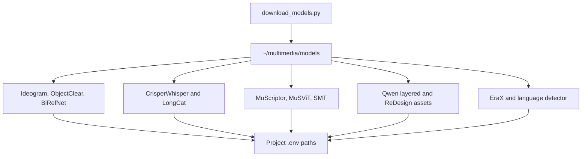

# Model Store Architecture

The `models` directory is an untracked local artifact bank. The monorepo tracks only its stateful downloader, this runtime map, and a short setup notice.

## Architecture



## Populate the store

```bash
cd ~/multimedia/models
uv venv --python 3.12.10 --seed --managed-python .venv
source .venv/bin/activate
uv pip install huggingface_hub hf_xet
python download_models.py
```

The first interactive question selects parallel workers. That value controls
both Hugging Face file workers and the Rust Xet Tokio runtime; use
`--workers N` for a noninteractive run. The script uses explicit
`snapshot_download` destinations, is resumable after interruption, and
recreates nested caches and ReDesign weight paths needed by the checked-in
runtimes. Current Hugging Face Hub releases use `hf_xet`; `hf_transfer` may
remain installed for older scripts but is no longer selected by Hub 1.x.
Rerunning the same bundle resumes its selected artifacts; the downloader never
deletes files that an older manifest or a different workflow placed in the
model store.

Selecting the translation bundle also migrates the historical
`text-only/anhbn--raX-Translator-V1.0-GGUF` folder to its canonical
`text-only/mradermacher--EraX-Translator-V1.0-GGUF` name when the canonical
folder does not already exist. The move occurs only after interactive
confirmation, or directly when `--yes` supplies that authorization, and keeps
the directory's resumable download metadata intact.

## Ownership

Projects consume artifacts through their `.env` paths. They do not rename or copy models into project folders, and runtime services do not silently download missing weights. The model tree, its temporary venv, caches, and downloaded model documentation remain outside Git.
