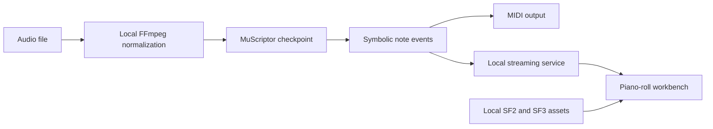

# MuScriptor Architecture and Operations

## Architecture



The CLI and browser service share the same local decoder. Generated frontend files are build output; the Python inference path and configured model/soundfont files are authoritative.

## Setup

Required host tools are `uv`, `ffmpeg`, and `bun`.

```bash
cd ~/multimedia/muscriptor
./setupwithuv gpu
```

Review `MUSCRIPTOR_MODEL_PATH`, `MUSCRIPTOR_SF2_PATH`, and `MUSCRIPTOR_SF3_PATH` in `.env` before starting inference.

## Runtime lanes

- Browser and streaming API: `./startwithuv` on port `8222`.
- One-file wrapper:

  ```bash
  source .venv/bin/activate
  uv run --active --no-sync python local_transcribe.py song.m4a \
    -o outputs/song.mid --instruments piano,bass,drums
  ```

- Installed package CLI: `muscriptor --help`.

Audio conversion, inference, event streaming, MIDI output, and soundfont preview remain on the host.
