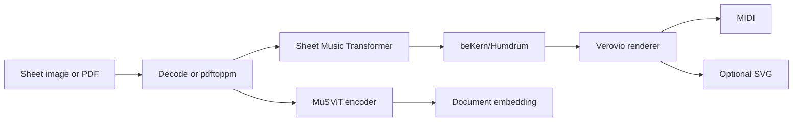

# MuSViT Architecture and Operations

## Architecture



The score-to-MIDI decoder and the MuSViT foundation encoder are separate runtime lanes. The foundation checkpoint is used for representations; the SMT checkpoint performs notation decoding.

## Setup

Required host tools are `uv` and `pdftoppm` from Poppler for PDF input.

```bash
cd ~/multimedia/musvit
./setupwithuv gpu
```

Review `MUSVIT_MODEL_PATH`, `SMT_MODEL_PATH`, and `SMT_SOURCE_PATH` in `.env` after populating the shared model store.

## Runtime lanes

- Score conversion:

  ```bash
  ./startwithuv score.pdf --page 2 -o outputs/page-2.mid
  ```

- Encoder representations:

  ```bash
  source .venv/bin/activate
  uv run --active --no-sync python musvit_embed.py staff.png \
    --layout pad --patches
  ```

Conversion keeps the intermediate notation beside MIDI and optional SVG output so recognition can be inspected.
