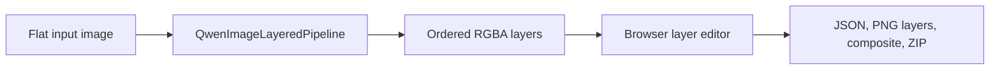

# ReDesign Architecture and Operations

## Direct local lane



The browser workbench owns one resident Diffusers pipeline. **Load model**
constructs Qwen-Image-Layered from the local FP8 transformer, modular Diffusers
components, and Qwen-VL encoder; **Unload model** releases it. Diffusers group
offload keeps the compact Qwen-VL encoder and VAE resident while streaming the
large image transformer in small block groups. Another resident model server
therefore keeps a substantial VRAM margin without making caption generation
pay leaf-level transfer costs. A decomposition reuses the pipeline and writes
aligned RGBA layers plus `parse.json`, `layer_manifest.json`, and composite
previews.

This lane has no controller, vLLM, OpenAI-compatible endpoint, ComfyUI, cloud
fallback, or telemetry path. The older upstream agent graph remains source
material for the individual detector, segmentation, text, and vector tools,
but it is not on the browser execution path.

## Setup and start

```bash
cd ~/multimedia/redesign
./setupwithuv gpu
cp .env.local.example .env   # only when .env does not already exist
./startwithuv                # http://127.0.0.1:8173
```

The default runtime combines:

- the mixed FP8/BF16 layered transformer under
  `~/multimedia/models/qwen/T5B--qwen-image-layered-fp8/`;
- the modular scheduler, processor, tokenizer, VAE, and architecture under
  `~/multimedia/models/qwen/diffusers--hfstaff--Qwen-Image-Layered-modular/`;
- the local Qwen-VL encoder under the complete SDNQ tree.

The corresponding `REDESIGN_DIFFUSERS_*` paths and offload profile are
explicit in `.env.local.example`.

`REDESIGN_DIFFUSERS_OFFLOAD=group` is the default coexistence profile. When
other GPU model servers have deliberately been stopped, `model` is faster and
`none` is the fully GPU-resident exclusive profile. Do not use the latter two
beside a large resident model server unless their combined VRAM budget has
been checked first.

## Workbench workflow

1. Start the server and click **Load model** once.
2. Select a PNG, JPEG, or WebP image.
3. Choose layer count, inference steps, 640/1024 resolution, CFG, and seed.
4. Click **Decompose design**. Further runs reuse the resident model.
5. Edit visibility, order, geometry, opacity, and text metadata in the layer
   canvas, then click **Export layers**.
6. Click **Unload model** when the GPU memory should be returned.

The direct CLI primitives under `./redesign` remain available for detection,
text extraction, connected-component splitting, vectorization, and export.
