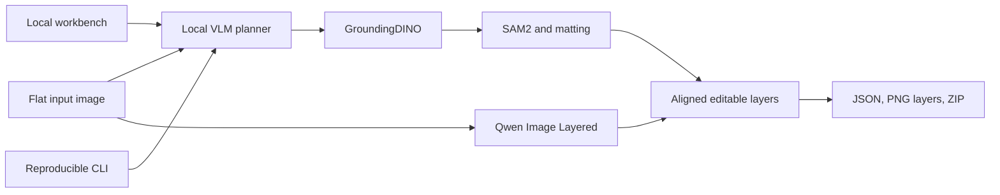

# ReDesign Architecture and Operations

## Architecture



Planning, detection, segmentation, layered generation, and export are independent stages. Each primitive can run without starting the browser workbench.

## Setup

```bash
cd ~/multimedia/redesign
./setupwithuv gpu
cp .env.local.example .env   # only when .env does not already exist
./redesign doctor
```

Review the local VLM endpoint and all Qwen, detector, segmenter, and cache paths before inference. Models stay in the shared store.

## Runtime lanes

- Complete decomposition:

  ```bash
  ./redesign decompose flat-design.png --output redesign-output
  ```

- Individual primitive:

  ```bash
  ./redesign detect flat-design.png \
    --labels 'illustration,logo,button' -o objects
  ```

- Editable package:

  ```bash
  ./redesign export redesign-output/episodes/flat-design/parse.json \
    --source flat-design.png
  ```

- Browser workbench: `./startwithuv` on port `8173` by default.

Native Diffusers is the primary layered-image backend. An existing local ComfyUI endpoint is an optional compatibility lane, not a required service.
