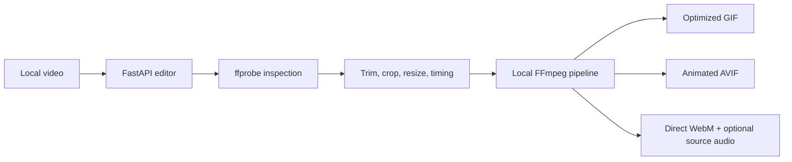

# Video to GIF and AVIF Architecture

## Architecture



GIF, AVIF, and WebM share the same local FFmpeg preparation path. GIF adds palette, dithering, and optional CUDA decode/resize controls; its palette analysis and final GIF encoder remain CPU-only. AVIF adds quality, effort, bit-depth, and available hardware-encoder controls. WebM is a direct one-pass output with AV1 NVENC or software VP9 and independently toggled Opus source audio.

## Setup and run

```bash
cd ~/multimedia/video-to-gif-avif
./setupwithuv cpu
./startwithuv
```

The service listens on port `8241` unless `.env` overrides it. Animated AVIF requires matching muxer and encoder support in the host FFmpeg build.

## Runtime lanes

- Browser editor: `./startwithuv`.
- CLI engine:

  ```bash
  uv run python engine.py clip.mp4 clip.gif \
    --format gif --start 2.4 --end 7.8 --width 720 --fps 15 \
    --colors 256 --dither sierra2_4a --palette diff
  ```

  ```bash
  uv run python engine.py clip.mp4 clip.webm \
    --format webm --webm-engine nvenc --webm-quality 78
  ```

Inputs, intermediate frames, and outputs remain on local storage.
