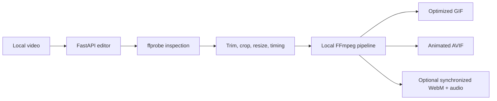

# Video to GIF and AVIF Architecture

## Architecture



GIF and AVIF share the same local media preparation path. GIF adds palette and dithering controls; AVIF adds quality, effort, bit-depth, and available hardware-encoder controls. Because neither animation format carries a dependable audio track, the sound toggle emits a matching WebM companion with the same trim, crop, rotation, dimensions, frame rate, and playback speed.

## Setup and run

```bash
cd ~/multimedia/video-to-gif-avif
./setupwithuv cpu
./startwithuv
```

The service listens on port `8241` unless `.env` overrides it. Animated AVIF requires matching muxer and encoder support in the host FFmpeg build.

## Runtime lanes

- Browser editor: `./startwithuv`.
- CLI engine:

  ```bash
  uv run python engine.py clip.mp4 clip.gif \
    --format gif --start 2.4 --end 7.8 --width 720 --fps 15 \
    --colors 256 --dither sierra2_4a --palette diff
  ```

Inputs, intermediate frames, and outputs remain on local storage.
