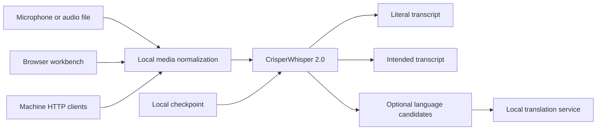

# CrisperWhisper Architecture and Operations

## Architecture



The browser and machine service share inference code but own separate model lifecycles. Known-language requests use one full pass. The optional `detect` route creates low-budget candidates, delegates request-scoped arbitration, then runs one final pass with the selected language.

## Setup

```bash
cd ~/multimedia/whisper
./setupwithuv gpu
```

Review the checkpoint, backend, device, dtype, and listener values in `.env`. Setup does not download weights.

## Runtime lanes

- Machine HTTP backend: `./starthttp.sh` on port `8172`.
- Browser workbench: `./startwithuv.sh` on port `8173`.
- CLI:

  ```bash
  source .venv/bin/activate
  uv run --active --no-sync python -m local_app.cli recording.m4a \
    --operation both --language en --output transcript.json
  ```

- Optional native launcher: `cargo build --release --manifest-path native/Cargo.toml`.

Browser-owned and HTTP-owned weights can be loaded, checked, reused, and unloaded independently.
